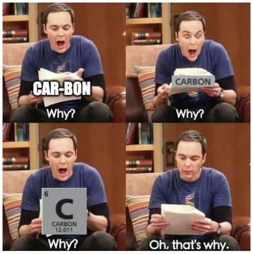

The trend of replacing golden programming languages with modern options is becoming very popular. But will they stand the test of time.
Microsoft did this when they released TypeScript, Jet brains released Kotlin to replace Java and now Google is doing same with the experimental release of Carbon. 

## Is there a need for Carbon

<!--truncate-->

Unless you’re new to programming, you will know that C++ has been one of the more efficient programming languages for a long time and is usually taught at the foundational level of computer science. This is because it is a high-level language with a lot of low-level features. However, memory corruption, no garbage collection and the general complexity of the language and its syntaxes makes it long overdue for a replacement.

## What is Carbon Anayways?

> Google’s Principal Software Engineer Chandler Carruth at the “CPP North” C++ conference in Toronto announced Carbon, which is an experimental language created to do what Rust couldn’t do, replace C++.

The major feature that will make this a viable option is Carbon’s bi-directional interoperability which means a library anywhere in an existing C++ stack can adopt Carbon without porting the rest and a more human readable syntax. This is a similar approach Apple took when switching from objective C to swift.
### Analogy
To clear the air on it being a C++ replacement, I see it as more of a successor of C++. Take it like the black panther movie. The black panther (Rust in this case) was to be crowned king until a more viable option Kill Monger (In this case Carbon) came into the scene. 

This was done not because the previous king was bad (C++ in this case) but simply because the time had come. It will take some time for this story to unfold.

Who knows it might end up as the rightful successor or maybe another player might come into the game or Rust might prove its critics wrong and beocme the rightful successor?
<iframe src="https://giphy.com/embed/o6FWop1Gbuyly" width="480" height="199" frameBorder="0" class="giphy-embed"></iframe>

## Features of Carbon 📋

- Introduces keywords and removes older ones (no more “cout  and cin ” related errors) and simpler grammar.

- The input parameters of functions are read-only values and their pointers provide an indirect access and mutation
- Can import API like Boost and QT through the package name
- Generics which are a more type safe implementation of C++ Templates
- Explicit object parameters declare a method and has a single interface
- Open source

## Testing ⚙️
Since it’s only experimental at this stage, it will require a <a href="https://llvm.org/">LLVM (Low Level Virtual Machine)</a> and <a href="https://bazel.build/">Bazel</a> running on a WSL to use it.
There is no working compiler or toolchain at this stage. But upon testing the demo on my Ubuntu WSL, the results with speed can be compared with that of C++. But I should state that it was only a simple Hello world program. 

[Check this article out to learn how to test carbon for yourself](https://polite-bay-0071b4b10.1.azurestaticapps.net/blog/Testing%20Carbon%20Programming%20Language)

## Open Source Contribution 
Maybe Rust might not be your favorite in this story, you can accelerate the succession by contributing to the project on GitHub. It takes C++, Python and some JavaScript skills to do so. 

[Carbon on GitHub](https://github.com/carbon-language/carbon-lang)

