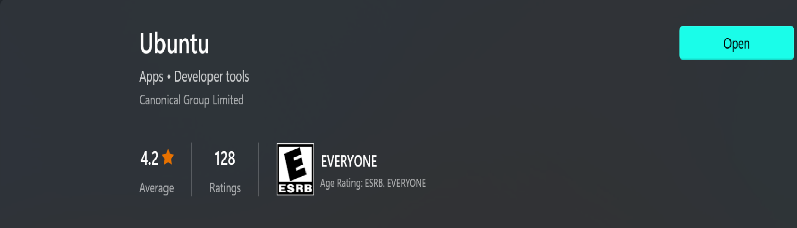
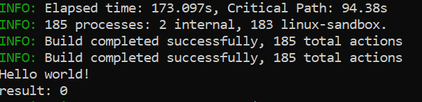

This tutorial will take you through the steps required to test **Carbon** on your machine


<!--truncate-->

:::caution

If your internet connection is slow, the installation might lead to an error. For some packages when you restart installation you will be faced with an error. 
```bash
sudo apt-get remove *package_name*
```

:::


## Installing WSL 

If you are on Windows, you need to install Ubuntu WSL. Simply go to the Microsoft Store, search for it and download it. You will be asked to set a password do not forget it



Mac and Linux do not need to complete the first step

## Installing Brew

Next, install brew on your machine. If you don’t have it installed already run the following set of commands in your terminal.
```bash
sudo apt update 
```

Install tools required to install brew
sudo apt-get install build-essential curl file git
run this command to install from github

```bash
/bin/bash -c "$(curl -fsSL https://raw.githubusercontent.com/Homebrew install/master/install.sh)" 
```

Now add Brew to your system path by runningthe four command s below in succession
```bash
test -d ~/.linuxbrew && eval $(~/.linuxbrew/bin/brew shellenv) 
```
```bash
test -d /home/linuxbrew/.linuxbrew && eval $(/home/linuxbrew/.linuxbrew/bin/brew shellenv)
```
```bash
test -r ~/.bash_profile && echo "eval \$($(brew --prefix)/bin/brew shellenv)" >>~/.bash_profile
```
```bash
echo "eval \$($(brew --prefix)/bin/brew shellenv)" >>~/.profile
```
Now Install Git with brew

```bash
brew install git
```
## After installing Brew
For those who already have brew installed, run this command to install bazael
```bash 
brew install bazelisk
```
Install the LLVM
```bash
brew install llvm
```
```bash
export PATH="$(brew --prefix llvm)/bin:${PATH}"
```
Clone the carbon repo
```bash
git clone https://github.com/carbon-language/carbon-lang
```
Change your directory to the carbon repo
```bash
cd carbon-lang
```
Now run
```bash
bazel run //explorer -- ./explorer/testdata/print/format_only.carbon
```
If you face a fatal error: zlib.h: no such file or directory error run this command
```bash
sudo apt-get install libz-dev
```

If all is well you should see a Hello world output in the terminal.



As at now this is the only demo available. 
But the developers of Carbon promise to release more soon so get ready to work some magic with carbon in your WSL.
Thank you for reading

[Carbon on GitHub](https://github.com/carbon-language/carbon-lang)
<script async src="https://pagead2.googlesyndication.com/pagead/js/adsbygoogle.js?client=ca-pub-2651219914227916"
     crossorigin="anonymous"></script>
