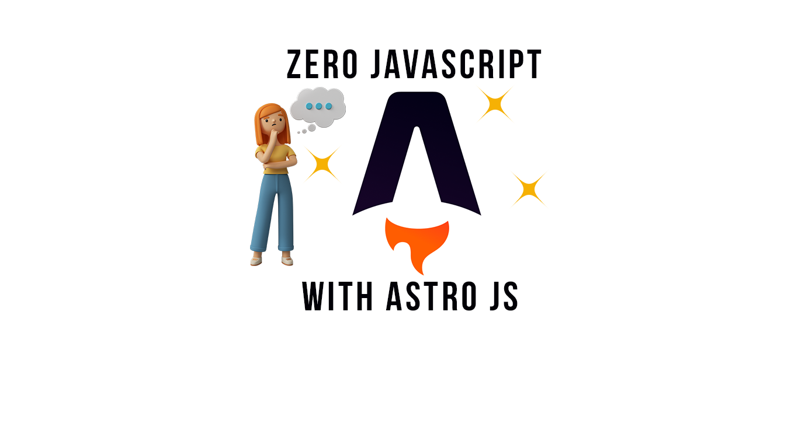

97.6% of websites around the world use [JavaScript](https://w3techs.com/technologies/details/cp-javascript#:~:text=JavaScript%20is%20used%20as%20client,98.0%25%20of%20all%20the%20websites.). As great as this may be, websites that heavily rely on JS have high [Time to interact scores](https://web.dev/interactive/) (TTI)causing slower page loads and performance. So what do we do, sacrifice the complex features that make our web pages nicer and more interactive, or turn a deaf ear to TTI? Luckily **Astro JS** comes to our rescue.

<!--truncate-->

## What is Astro JS❓

Well, [Astro JS](https://astro.build/) is a newly developed multipage, all-in-one web framework that focuses on fast content-driven websites. It boasts of Zero JavaScript for static websites and only ships JavaScript when necessary.

If you're new to this concept, the question on your mind might be "what sorcery is this"

<iframe src="https://giphy.com/embed/ErHMDXYMfGH96" width="480" height="373" frameBorder="0" class="giphy-embed" allowFullScreen></iframe>

<ul>
<li>To achieve this feat, Astro uses component islands. This is a shift from the regular front-end architecture. It extracts the UI into smaller isolated components. Any unused JS is replaced with HTML making it static and lightweight.</li>
<li>
This is based on a concept known as partial hydration
</li> 
<li>
It works great for static output or server output required on demand and works well with a filesystem, CMS like Storyblok as well as databases and APIs
</li>
<li>
An impressive feature of Astro is that it integrates easily with front-end frameworks like alpine JS, lit, Preact, React, Solid JS, svelte, and Vue JS
</li>
<li>
And as if this wasn't enough, it is made edge ready and hence can be integrated with SSR() adapters like Cloudflare, Vercel, Node JS, Deno, and Netlify ( I hope to see Bun JS getting in on the action soon).
</li>
</ul>

## Core Features ⚙️

1. Component Islands
2. Server-first API
3. Zero JavaScript
4. Edge ready
5. Highly customizable
6. UI- agnostic (meaning it is interoperable with a lot of UI frameworks)

Astro promises to be an all-in-one web framework. This is becoming more of a cliché with web frameworks and I'm honestly getting fed up howeverI think Astro might actually be the real deal and hopefully, my hopes will not be shattered.

Thank you for reading.

An explanation on Partial hydration can be found [here](https://markus.oberlehner.net/blog/partial-hydration-concepts-lazy-and-active/) in case it wasn't clear to you
Getting started with Astro is simple just run npm create astro@latest in your terminal to get started. You can follow [this](https://www.youtube.com/watch?v=-5UPq7Lv9Sc) tutorial to build a simple project
